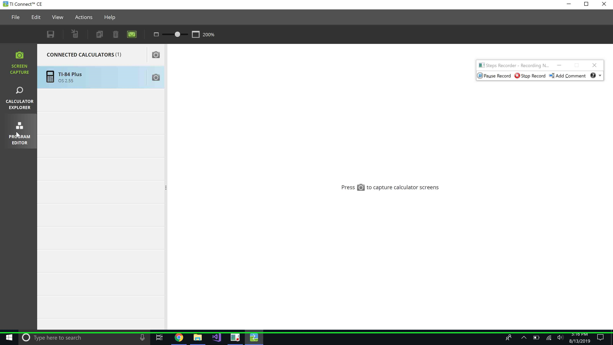
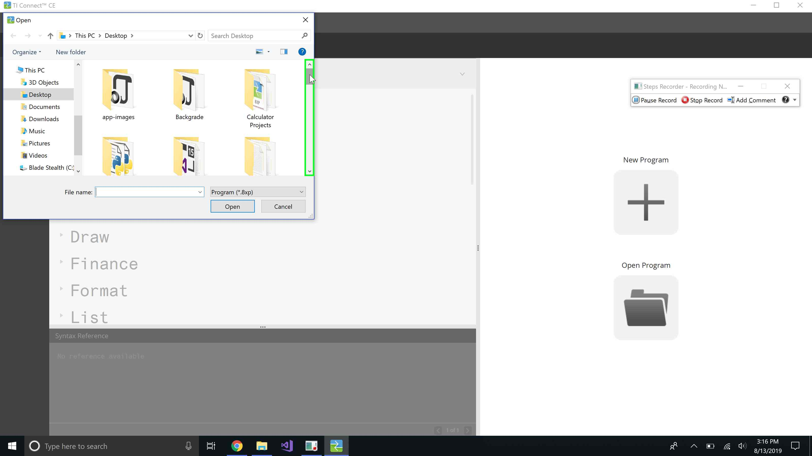

# TI-83 / 84 Projects
Authored by [erwijet](http://github.com/erwijet)

## Programs List
|Project Name|Includes Binary & Decomp| Includes Macroed Source Code|
|---|:---:|:---:|
|[Tic Tac Toe](https://github.com/erwijet/TI-84-Projects/tree/master/Projects/Tic-Tac-Toe)| ✔ | ✔ |
|[pH Calculator](https://github.com/erwijet/TI-84-Projects/tree/master/Projects/pH-Calculator)| ✔ | [❌](? "Yeahh, so I didn't know about the commenting and macro features when I made this project, so they aren't included 😬") |

## File Structure

### .8xp File
Within each project folder, you should file 2 or 3 files. You will always file a tokenized/compiled .8xp file. In addition to the compiled 'binary' (and I use that term loosely because *technically* it's tokenized, not compiled), but I digress. This is a file that can be directly loaded onto a TI-83/84 calculator. In addition, this binary file can also be loaded directly onto an emulator, such as Wabbit, which was the emulator I chose to use in development, in addition to a physical TI-84 Plus.

### .txt.8xp File
This is the file that contains the most human-readable version of the program. Some programs may not have this version. It is worth noting: **THIS FILE CANNOT BE LOADED DIRECTLY INTO A CALCULATOR OR TI-CONNECT (CE)**. This is because it contains pre-processor commands and unsupported comments. `#define variableName A` would allow use of full variable names, in lieu of the single-letter registry. Furthermore, comments in the format of `// this is a comment`are not supported in native TI-BASIC tokenizers and compilers. The define macros and slash-slash comments *are* supported in TokensIDE, which was the software I chose to use. TokensIDE would transpile the source code, resolving any macros, and removing any slash-slash comments.

### (decomp).txt.8xp File
This file will always be included in a project folder. This is the decompiled / detokenized text source code for the binary. This, unlike the straight .txt.8xp file, ***IS COMPATABLE*** with TI-CONNECT and TI-CONNECT CE. Any comments in this file are string-based comments that are included in the binary, and thusly are viewable on the calculator after upload. These comments are just strings, which are formatted as parameters to a noOp, so really they just take up space, and make the source code easier to read 😜.

## Tools

### TokensIDE
As I mentioned earlier, I used TokensIDE for my development workspace. This was primarily due to the native macro support, pre-processor commands, such as `#if` and `#undef`, slash-slash comment support, and native support for Wabbit. 

### WabbitEMU
This is hands-down, the best non-web-based TI calculator emulator I have found. I chose wabbit because of its command-line support for file upload, that means no dragging of binary files or folder nonsense. 

### A physical TI-84 Plus
I made sure to use a physical TI-84 for three reasons. The first was because, morally, I should use an emulator without having purchased the real thing. Two, I needed the ROM image, and honestly, who can you trust online. And lastly, I needed to make sure my applications could run with the speed and style that they had performed with in the emulator. It never hurts to try out what users will be using yourself.

## How to Upload
So if you have never send a file up to your calculator before, I can walk you through it.
### TI-84
1. Connect your calculator to the computer using the included Male USB-A to Male USB-B Mini converter. If you do not own one, you can buy one online (or just look up a picture and head to a Goodwill or thrift store to pick one up for like, .99 cents. They are getting obsoleted **so** fast)
2. Make sure you have TI-CONNECT CE installed. This will work with the old version of TI-CONNECT, but its a pain and takes forever, and is so old that you can watch a YouTube video on how to do it, but I will only cover TI-CONNECT CE.
3. 
4. 
5. 
6. 
7. 
8. 
### TI-83
Oh boy, I really hope you are not reading this because you only have a TI-83. Let me tell you. Okay, so the only real way to make this work is to use the TI-LINK cable. This looks like an aux cord for music, but it is slightly smaller on both ends. One end goes into a TI-83 and the other goes into a TI-84 that has the program on it. Yes, you need the other calculator with the program on it unless you use the TI-GRAPH cable, and i'll be honest, I have never had much sucess with that. The port on the TI-83 is right at the bottem, and the port on the TI-84 is on the top, labeled I/O.

Once the Calculators are linked together, on the TI-83, press the following

- [2nd]
- LINK
- [LEFT_ARROW]
- [ENTER]
 
 This will but the calculator in *RECEIVE* mode, but it will error quickly unless you do the following on the TI-84 with haste.
 
 - [2nd]
 - [LINK]
 - Select Prgm
 - Select the program name
 - [LEFT_ARROW]
 - [ENTER]

With some luck, the transfer will work and you will not get the `Error in Xmit` message, if you do, just click quit and try it again on both calculators, but faster. The whole thing is just a royal pain, and I really hope you don't only have a TI-83.

## Follow Me!
      
